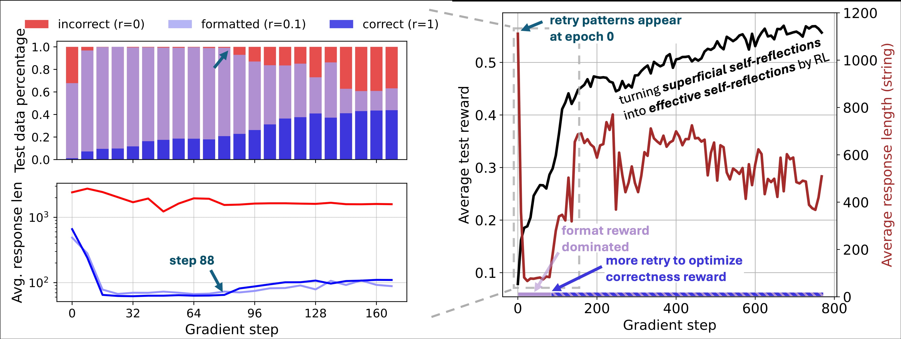

# There May Not be Aha Moment in R1-Zero-like Training — A Pilot Study

<!-- Blog: [](notion_link) -->

**Blog:** <a href="https://oatllm.notion.site/oat-zero">
    
</a>

[Installation](#installation) | [Experiments](#experiments) | [Acknowledgement](#acknowledgement) | [Citation](#citation) 

---

One of the most inspiring results from DeepSeek-R1-Zero is the occurrence of “Aha moment” through pure reinforcement learning (RL). At the Aha moment, the model learns emergent skills such as self-reflection, which helps it to conduct in-context search to solve complex reasoning problems.

Within only a few days after R1-Zero's release, several projects independently “reproduced” R1-Zero-like training on smaller scales (e.g., 1B to 7B) and all observed the Aha moment, which is typically measured by ***a sudden increase of model response length***. We follow their settings to scrutinize the R1-Zero-like training process, and share the following findings:

1. **There may NOT be Aha moment in R1-Zero-like training.** Instead, we found Aha moment (such as self-reflection patterns) appears at epoch 0, namely base models.
2. We found **Superficial Self-Reflection (SSR)** from base models' responses, in which case self-reflections do not necessarily lead to correct final answers.
3. We took **a closer look at R1-Zero-like training via RL**, and found that the increasing response length phenomenon is not due to the emergence of self-reflection, but a consequence of RL optimizing well-designed rule-based reward functions.



> (Left) A detailed analysis on the distribution and average length of different response groups. (Right) RL curves of test reward and model response length.

## Installation

Our implementation is based on [Oat](https://github.com/sail-sg/oat). Run the following command to install `oat`:

```console
pip install vllm==0.6.2 && pip install oat-llm
```
Or you could also install in "editable" mode for local development:

```console
git clone https://github.com/sail-sg/oat.git
cd oat
pip install vllm==0.6.2 && pip install -e .
```

## Experiments

### Evaluating Self-Reflection Behavior

To evaluate the self-reflection behavior of the base model, run:

```console
# example of analyzing Qwen/Qwen2.5-Math-7B
bash analysis/script.sh Qwen/Qwen2.5-Math-7B
```

Simply run the script with the model name as the argument.


### Reproducing Oat-Zero

To reproduce the results of Oat-Zero on Countdown task (Sec. 3.1 in our [blog](https://oatllm.notion.site/oat-zero)), run: 

```console
bash training/run_grpo.sh
```

To reproduce the results in Sec. 3.2, please follow the instructions in [simpleRL/train](https://github.com/hkust-nlp/simpleRL-reason/tree/main/train). 

## Acknowledgement

- [Oat](https://github.com/sail-sg/oat): Used for fast reproducing the R1-Zero-like training results on the Countdown task.
- [simpleRL](https://github.com/hkust-nlp/simpleRL-reason): Used for reproducing the SimpleRL-Zero results on MATH.
- [TinyZero](https://github.com/Jiayi-Pan/TinyZero): Referring to the implementation of reward model and Countdown task.
- [vLLM](https://github.com/vllm-project/vllm): Used for the accelerated inference.
- We thank the developers of DeepSeek, Qwen, Rho and Llama for bringing the innovative techniques and performant models in our community. 

## Citation

```bibtex
@misc{liu2025oatzero,
  title={There May Not be Aha Moment in R1-Zero-like Training — A Pilot Study},
  author={Zichen Liu and Changyu Chen and Wenjun Li and Tianyu Pang and Chao Du and Min Lin},
  year={2025},
  howpublished={\url{https://oatllm.notion.site/oat-zero}},
  note={Notion Blog},
}
```


## License

`oat-zero` is distributed under the terms of the [MIT](https://spdx.org/licenses/MIT.html) license.
